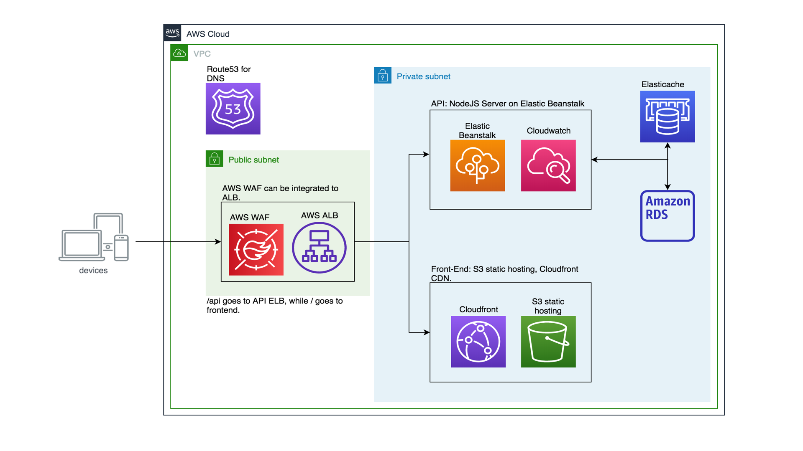

# Deploys microservices using Terraform

Terraform scripts to deploy an API and frontend microservices.

### 1. Architecture

#### 1.1. Architecture Option 1

The picture below shows one architecture option. Here we use Auto Scaling Group
and Elastic Load Balancer to ensure that the apps are fault tolerant and
highly-scalable.

The advantage of this architecture is that it is quite vendor agnostic. The code
resides within the NodeJS servers and can be moved to other cloud at any time.

#### 1.2. Architecture Option 2

The picture below shows an alternative architecture. Here we use Elastic Beanstalk
to host the API and Cloudwatch for monitoring logs and resources.

On the frontend, we use S3 static hosting and Cloudfront CDN.

The advantage of this architecture is that there is less management to be done
since we are using AWS's managed resources. However, we are more vendor locked in.

#### 1.3. Deployed Architecture

Architecture Option 1 is the one that is shown in the Terraform scripts in this
repository. 

Some elements of the architecture are not reflected in the Terraform script
because of lack of time. These elements are: Route53, AWS WAF, and AWS Elasticache.

### 2. Deployment

#### 2.1. Code Organisation

Code used in this project is organised into modules. For example, the code for
deploying the API can be found [here](https://github.com/devacto/hooq/blob/master/modules/api/main.tf).
Front-end, database, and reverse proxy Terraform codes are also stored in their respective folders.

#### 2.2. ALB Rules

The reverse proxy Terraform code can be found [here](https://github.com/devacto/hooq/blob/master/modules/reverseproxy/main.tf).

Pictures below show this ALB being deployed, and its ALB rules.

#### 2.2. Deployment Environments

Deployment environments such as `dev`, or `prod`, is reflected using Terraform variables.
Here 

### 3. Integration with BuildKite

BuildKite is a continuous integration and deployment runner similar to Jenkins.

#### 3.1. Pipeline-as-code

#### 3.2. Secure secrets
