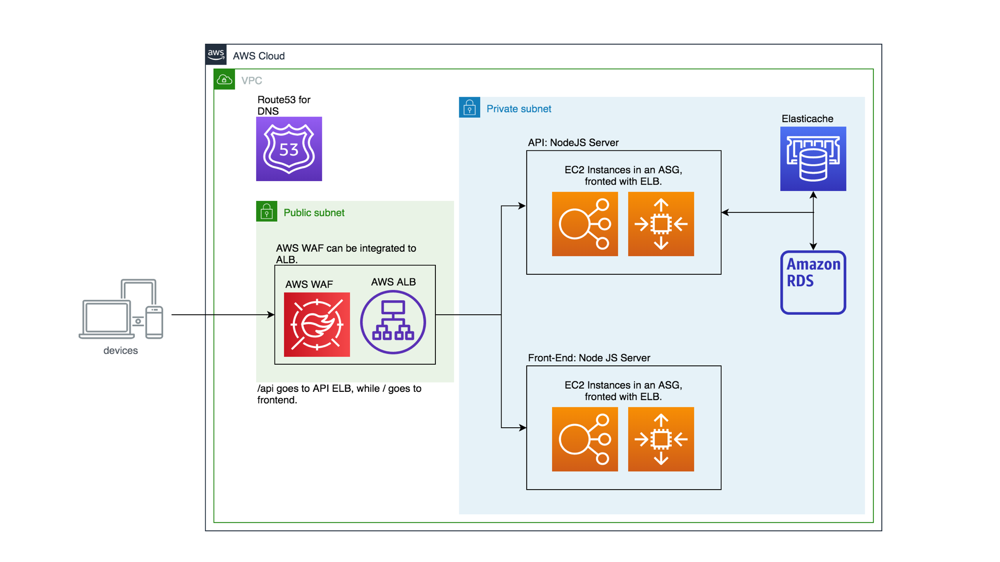

# Deploys microservices using Terraform

Terraform scripts to deploy an API and frontend microservices.

### 1. Architecture

#### 1.1. Architecture Option 1

The picture below shows 

#### 1.2. Architecture Option 2

#### 1.3. Not Deployed

Some elements of the architecture are not reflected in the Terraform script
because of lack of time.

These elements are: Route53, AWS WAF, and AWS Elasticache.

### 2. Deployment

### 3. Deployment Environments

### 4. Integration with BuildKite

### 5. Secrets Management
